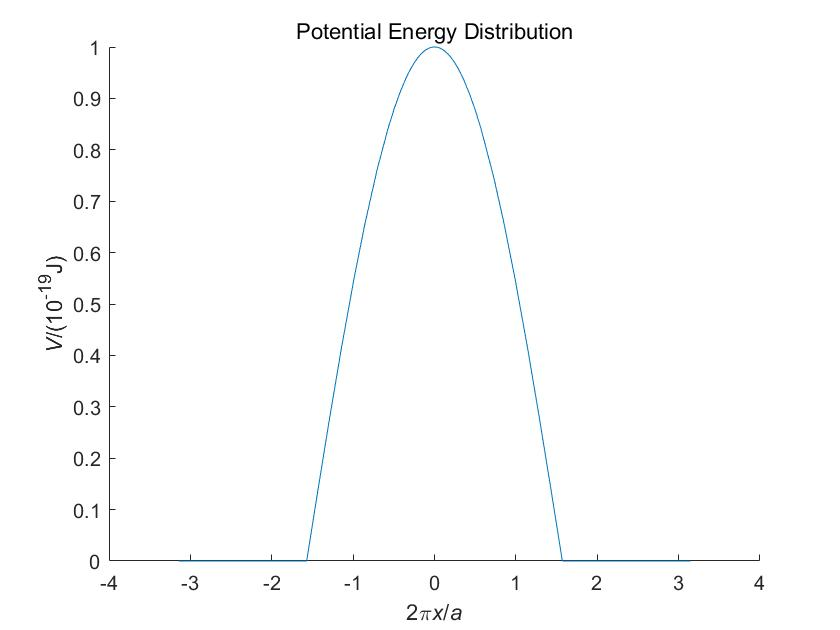
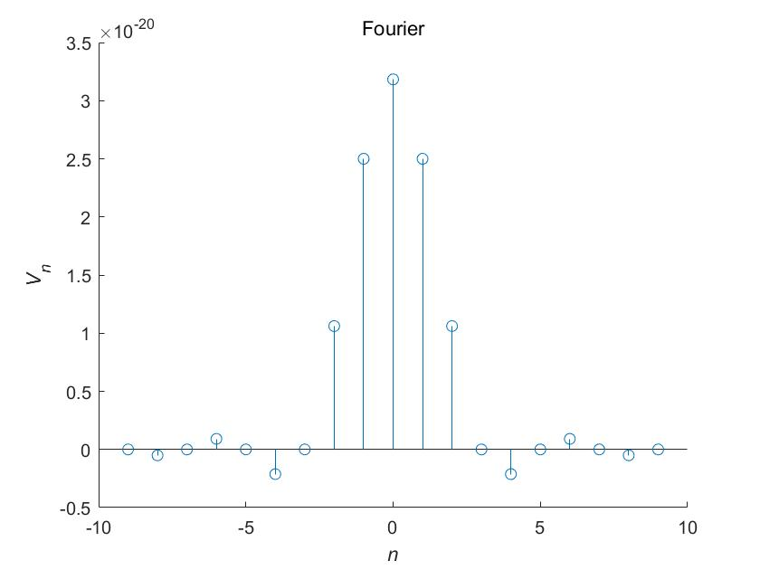
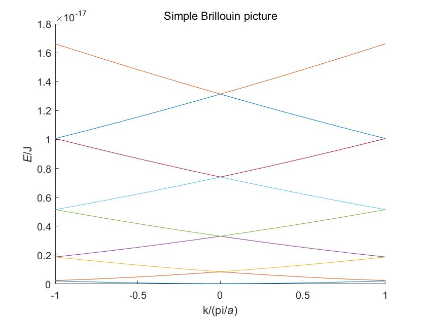
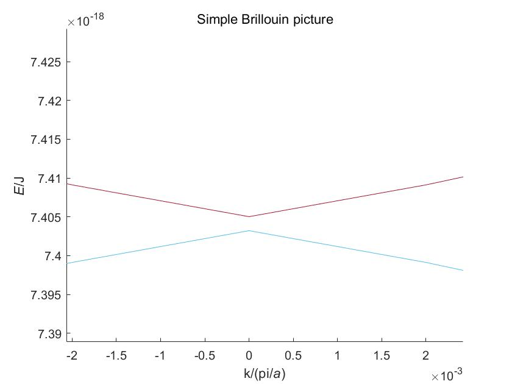
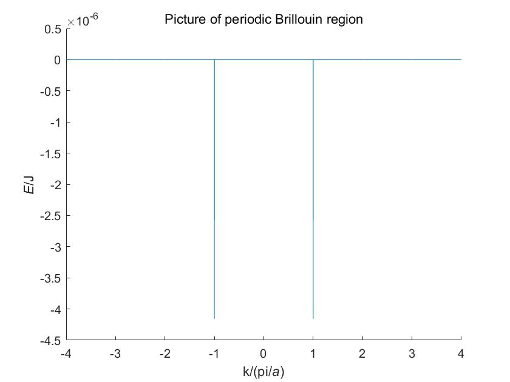
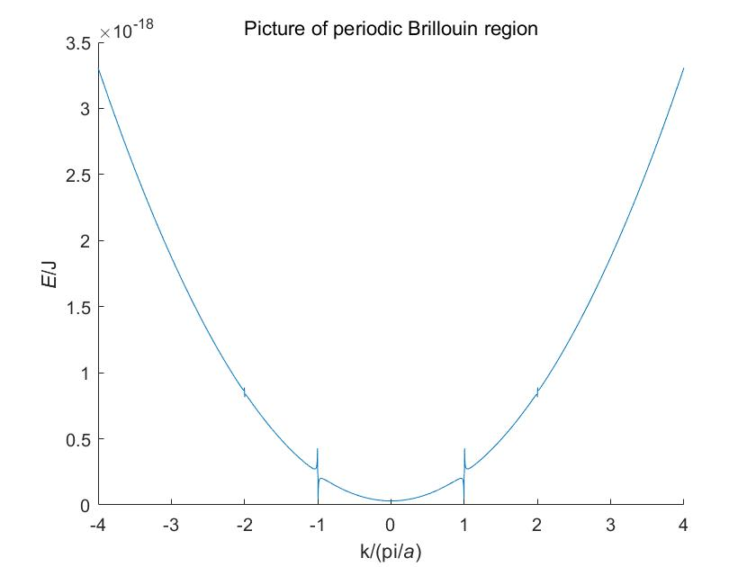
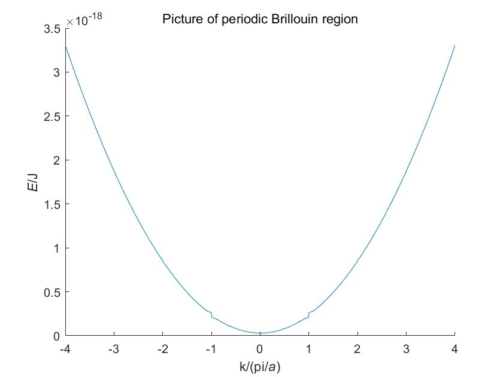
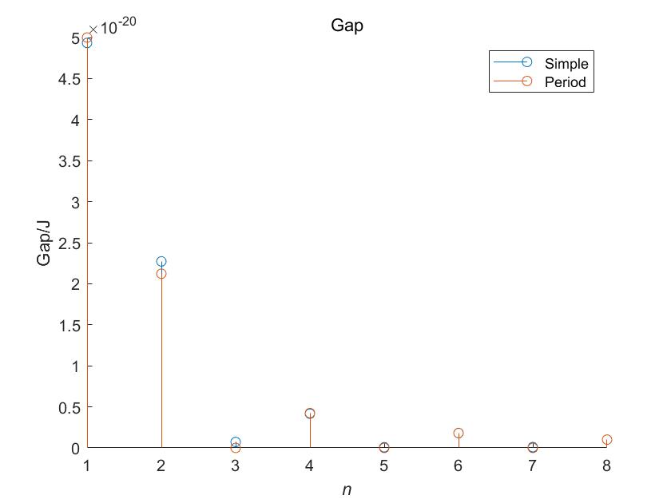

# 固体物理大作业

---

2019011008 无92 刘雪枫

---

## 目录

[TOC]

---

## 绘制势场

通过给定的一个周期内的势场公式：

$$V(x)=\begin{cases}1\times10^{-19}\cos\frac{2\pi}{a}x,-\frac{\pi}{2}\leq\frac{2\pi}{a}x\leq\frac{\pi}{2}\\0,\text{otherwise}\end{cases}$$

在一个周期内绘制势场的图像即可：

```matlab
% constants

a = 5.43e-10;
m0 = 9.1e-31;
h = 6.63e-34;

Vfunc = @(x) (2*pi/a * x >= -pi/2 & 2*pi/a * x <= pi/2) .* 1e-19 .* cos(2*pi/a * x);
figure;
hold on;
fplot(@(x) Vfunc(a/(2*pi)*x) * 1e19, [-pi, pi]);
title('Potential Energy Distribution');
xlabel('2\pi{\itx}/{\ita}');
ylabel('{\itV}/(10^{-19}J)')
```

结果如下图所示：



## 简约布里渊图景

通过解特征根绘制简约布里渊区图景。  

首先将势场进行傅里叶级数展开。本次实验计划绘制 `-4~4` 共不少于 8 条图线，因此将傅里叶系数展开到不少于 8 级，此处取 9 级别（令 `N=9`，`M=4`）：  

```matlab
syms x n;
Vsym(x) = piecewise((-a/4 <= x) & (x <= a/4), 1e-19 .* cos(2*pi/a * x), 0);
Vnsym(n) = 1/a * int(Vsym .* exp(-1j * n .* x * 2*pi/a), x, -a/2, a/2);
Vn = double(vpa(Vnsym(-N : N)));
figure;
hold on;
stem(-N : N, Vn);
title('Fourier');
xlabel('{\itn}');
ylabel('{\itV_n}');
```

得到各级傅里叶系数如下图：  



简约波矢下，能量值即为矩阵的特征值。在代码中构造矩阵，再使用 `eig` 求解即可：  

```matlab
M = floor(N / 2);
selfmap = (-M : M)' - (-M : M) + N + 1;
basemat = Vn(selfmap);
constVal = (h/2/pi)^2 / (2*m0);

nstep = 1000;
k = -pi/a : (2*pi/a / nstep) : pi / a;
lenk = length(k);
eigs = zeros([2 * M + 1, lenk]);
for i = 1 : 1 : lenk
    diagVec = (k(i) - (-M : M) * (2*pi/a)).^2 * constVal;
    A = basemat + diag(diagVec);
    eigs(:, i) = eig(A);
end
```

得到的 `eigs` 即为特征根。由此绘制简约布里渊区图景：  

```matlab
figure;
hold on;
kgrid = k / pi * a;
for i = 1 : 1 : 2 * M + 1
    plot(kgrid, eigs(i, :));
end
title('Simple Brillouin picture');
xlabel('k/(pi/{\ita})');
ylabel('{\itE}/J');
```

于是得到简约布里渊区图景：  



如果放大局部交界点，会发现确实存在带隙：



## 计算简约布里渊图景的带隙宽度

下面计算带隙宽度。将简约布里渊图景的图线中的中央处，以及边缘处的交接处的带隙宽度都计算出来，可以得到八个带隙宽度：  

```matlab
midk = round((lenk + 1) / 2);
intval1 = (1 : floor(N / 2) * 2);
for i = 1 : 1 : floor(N / 2)
    intval1(i * 2 - 1) = eigs(i * 2, lenk) - eigs(i * 2 - 1, lenk);
    intval1(i * 2) = eigs(i * 2 + 1, midk) - eigs(i * 2, midk);
end
```

得到的数据：

```
1.0e-19 *

    0.4934    0.2272    0.0072    0.0417    0.0008    0.0180    0.0010    0.0101
```

## 近自由电子近似

近自由电子近似中，利用微扰计算。需要将零级微扰和二级微扰相加（一级微扰为零）：  

```matlab
k = -M * pi / a : 2*pi/a/nstep : M * pi / a;
lenk = length(k);
midk = round((lenk + 1) / 2);
kgrid = k / pi * a;

V0 = (Vn((length(Vn) + 1) / 2));
E0 = constVal * k.^2 + V0;
E2 = Vn'.^2 ./ (constVal * (k.^2 - (k + 2*pi/a * (-N:1:N)').^2));
E2(N + 1, :) = 0;
E2 = sum(E2);
E2(isnan(E2)) = 0;
figure;
hold on;
plot(kgrid, E0 + E2);
title('Picture of periodic Brillouin region');
xlabel('k/(pi/{\ita})');
ylabel('{\itE}/J');
```

得到图线如下：



可以看到这个图线与预想差别很大。究其原因，是因为在布里渊区边界，能量存在简并，而接近布里渊区边界的位置，计算接近于奇异，计算机浮点数精度不足造成溢出，因此造成该现象。为了观察情况，基于二级微扰应当远小于零级微扰的事实，我们把二级微扰大于零级微扰的二级微扰值置零，观察图线：  

```matlab
E2(abs(E2) > abs(E0)) = 0;
```

然后绘制图线，可以看到：



可以看到，总体上图线还是正确的，但是布里渊区边界存在很大误差，因此需要考虑简并微扰。  

在简并微扰中，布里渊区边界的能量分别为 $E_0-2\lvert V_n\rvert$ 和 $E_0+2\lvert V_n\rvert$，将其融入到非简并围绕中进行修正。此处为了方便使用 0.5 阶修正，即让函数值连续但导数不连续，即在线性修正的基础上去掉导数连续的条件，原因是通过观察发现线性修正时直线的斜率并不大，因此用原曲线的最高点代替线性修正中使得导数连续的点，则效果可以近似。如果需要更精确可以进行更高阶，例如线性（一阶）、抛物线（二阶）或三阶的的修正：  

```matlab
idxdelta = pi/2/a/(2*pi/a)*nstep;
E = E0 + E2;
Emid = (length(E) + 1) / 2;
mir = @(idx) Emid - (idx - Emid);
for i = 1 : 1 : M - 1
    ki = i * pi / a;
    [~, idx] = min(abs(k - ki));
    
    [~, maxidx] = max(E(round(idx - idxdelta) : idx - 5));
    maxidx = maxidx + round(idx - idxdelta) - 1;
    E(maxidx:idx) = linspace(E(maxidx), E0(idx) - Vn(i + N + 1), idx - maxidx + 1);

    minidx = idx + (idx - maxidx);
    E(idx:minidx) = linspace(E0(idx) + Vn(i + N + 1), E(minidx), minidx - idx + 1);
    
    [~, idx] = min(abs(k + ki));
    [~, maxidx] = max(E(idx + 5 : round(idx + idxdelta)));
    maxidx = maxidx + idx + 5 - 1;
    E(idx:maxidx) = linspace(E0(idx) - Vn(-i + N + 1), E(maxidx), maxidx - idx + 1);
    
    minidx = idx - (maxidx - idx);
    E(minidx:idx) = linspace(E(minidx), E0(idx) + Vn(-i + N + 1), idx - minidx + 1);
end

figure;
hold on;
plot(kgrid, E);
title('Picture of periodic Brillouin region');
xlabel('k/(pi/{\ita})');
ylabel('{\itE}/J');
```

修正之后得到的图像如下：



该图像为近自由电子近似下的周期布里渊区图景。  

## 带隙比较

之前得到了特征根求解求得的带隙宽度：

```
1.0e-19 *

    0.4934    0.2272    0.0072    0.0417    0.0008    0.0180    0.0010    0.0101
```

在近自由电子近似下，带隙宽度是 `2|Vn|`，其值计算如下：  

```matlab
intval2(tmp) = 2 * abs(Vn(tmp + N + 1));
```

得到：  

```
   1.0e-19 *

    0.5000    0.2122    0.0000    0.0424    0.0000    0.0182    0.0000    0.0101
```

可以看出差别不大。绘制其图像：  

```matlab
figure;
hold on;
stem(intval1);
stem(intval2);
title('Gap');
legend('Simple', 'Period');
xlabel('{\itn}');
ylabel('Gap/J');
```





可以看到，两者计算结果属实非常近似。  

计算相对误差也可以看出（由于个别数据接近于零，难以计算相对误差，因此取两者的平均值作为参考）：  

```matlab
(intval1 - intval2)./((intval1 + intval2) / 2)
```

得到：  

```
ans =

   -0.0133    0.0683    2.0000   -0.0170    2.0000   -0.0079    2.0000   -0.0047
```

可以看到除了个别的接近于零的点（3、5、7 级）之外，相对误差都非常小。  

## 附录 全部源代码

```matlab
clear; close all; clc;

% constants

a = 5.43e-10;
m0 = 9.1e-31;
h = 6.63e-34;

Vfunc = @(x) (2*pi/a * x >= -pi/2 & 2*pi/a * x <= pi/2) .* 1e-19 .* cos(2*pi/a * x);
figure;
hold on;
fplot(@(x) Vfunc(a/(2*pi)*x) * 1e19, [-pi, pi]);
title('Potential Energy Distribution');
xlabel('2\pi{\itx}/{\ita}');
ylabel('{\itV}/(10^{-19}J)')

a = 5.43e-10;
m0 = 9.1e-31;
h = 6.63e-34;
N = 9;

% Calculate Fourier of Vn

syms x n;
Vsym(x) = piecewise((-a/4 <= x) & (x <= a/4), 1e-19 .* cos(2*pi/a * x), 0);
Vnsym(n) = 1/a * int(Vsym .* exp(-1j * n .* x * 2*pi/a), x, -a/2, a/2);
Vn = double(vpa(Vnsym(-N : N)));
figure;
hold on;
stem(-N : N, Vn);
title('Fourier');
xlabel('{\itn}');
ylabel('{\itV_n}');
% preprocess

M = floor(N / 2);
selfmap = (-M : M)' - (-M : M) + N + 1;
basemat = Vn(selfmap);
constVal = (h/2/pi)^2 / (2*m0);

nstep = 1000;
k = -pi/a : (2*pi/a / nstep) : pi / a;
lenk = length(k);
eigs = zeros([2 * M + 1, lenk]);
for i = 1 : 1 : lenk
    diagVec = (k(i) - (-M : M) * (2*pi/a)).^2 * constVal;
    A = basemat + diag(diagVec);
    eigs(:, i) = eig(A);
end

figure;
hold on;
kgrid = k / pi * a;
for i = 1 : 1 : 2 * M + 1
    plot(kgrid, eigs(i, :));
end
title('Simple Brillouin picture');
xlabel('k/(pi/{\ita})');
ylabel('{\itE}/J');

midk = round((lenk + 1) / 2);
intval1 = (1 : floor(N / 2) * 2);
for i = 1 : 1 : floor(N / 2)
    intval1(i * 2 - 1) = eigs(i * 2, lenk) - eigs(i * 2 - 1, lenk);
    intval1(i * 2) = eigs(i * 2 + 1, midk) - eigs(i * 2, midk);
end

% Nearly-free electron model

k = -M * pi / a : 2*pi/a/nstep : M * pi / a;
lenk = length(k);
midk = round((lenk + 1) / 2);
kgrid = k / pi * a;

V0 = (Vn((length(Vn) + 1) / 2));
E0 = constVal * k.^2 + V0;
E2 = Vn'.^2 ./ (constVal * (k.^2 - (k + 2*pi/a * (-N:1:N)').^2));
E2(N + 1, :) = 0;
E2 = sum(E2);
E2(isnan(E2)) = 0;
figure;
hold on;
plot(kgrid, E0 + E2);
title('Picture of periodic Brillouin region');
xlabel('k/(pi/{\ita})');
ylabel('{\itE}/J');

E2(abs(E2) > abs(E0)) = 0;
figure;
hold on;
plot(kgrid, E0 + E2);
title('Picture of periodic Brillouin region');
xlabel('k/(pi/{\ita})');
ylabel('{\itE}/J');

idxdelta = pi/2/a/(2*pi/a)*nstep;
E = E0 + E2;
Emid = (length(E) + 1) / 2;
mir = @(idx) Emid - (idx - Emid);
for i = 1 : 1 : M - 1
    ki = i * pi / a;
    [~, idx] = min(abs(k - ki));
    
    [~, maxidx] = max(E(round(idx - idxdelta) : idx - 5));
    maxidx = maxidx + round(idx - idxdelta) - 1;
    E(maxidx:idx) = linspace(E(maxidx), E0(idx) - Vn(i + N + 1), idx - maxidx + 1);

    minidx = idx + (idx - maxidx);
    E(idx:minidx) = linspace(E0(idx) + Vn(i + N + 1), E(minidx), minidx - idx + 1);
    
    [~, idx] = min(abs(k + ki));
    [~, maxidx] = max(E(idx + 5 : round(idx + idxdelta)));
    maxidx = maxidx + idx + 5 - 1;
    E(idx:maxidx) = linspace(E0(idx) - Vn(-i + N + 1), E(maxidx), maxidx - idx + 1);
    
    minidx = idx - (maxidx - idx);
    E(minidx:idx) = linspace(E(minidx), E0(idx) + Vn(-i + N + 1), idx - minidx + 1);
end

figure;
hold on;
plot(kgrid, E);
title('Picture of periodic Brillouin region');
xlabel('k/(pi/{\ita})');
ylabel('{\itE}/J');

tmp = 1 : 8;
intval2(tmp) = 2 * abs(Vn(tmp + N + 1));

figure;
hold on;
stem(intval1);
stem(intval2);
title('Gap');
legend('Simple', 'Period');
xlabel('{\itn}');
ylabel('Gap/J');
```

